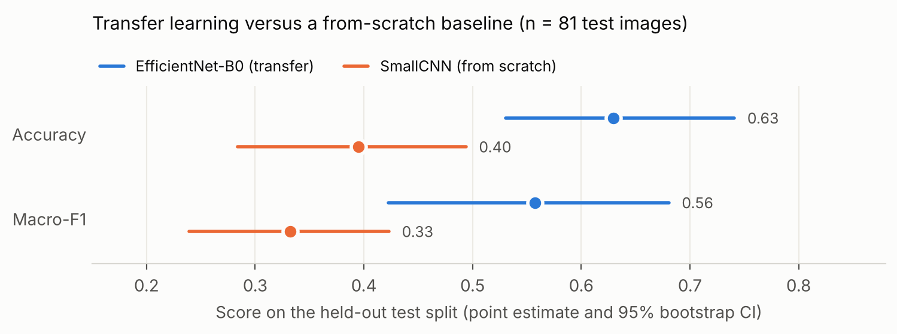
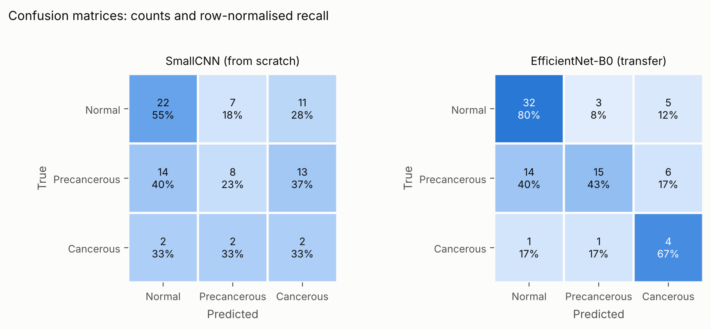

# Cervical VIA Image Classification

Three-class classification (Normal / Precancerous / Cancerous) of cervical
visual-inspection-with-acetic-acid (VIA) screening photographs, comparing an
ImageNet-pretrained EfficientNet-B0 against a from-scratch CNN baseline on a
small, case-grouped, class-imbalanced dataset.

The point of this repository is not the headline number — with 81 held-out
images it could not be. It is the evaluation discipline around that number:
a case-level split that is machine-verifiable, a controlled baseline trained
under identical conditions, and bootstrap intervals on every reported metric.



---

## Data

VIA screening photographs collected from publicly available teaching and field
atlases (IARC and Jhpiego). These are real clinical photographs rather than
curated benchmark images: resolution, illumination, white balance, speculum
position and field of view all vary between sources and between cases.

| | images | cases | Normal | Precancerous | Cancerous |
|---|---:|---:|---:|---:|---:|
| train | 367 | 226 | 185 | 148 | 34 |
| val | 84 | 38 | 42 | 30 | 12 |
| test | 84 | 37 | 40 | 38 | 6 |
| **total** | **535** | **301** | **267** | **216** | **52** |

`data/labels.csv` carries the image path, class, split and case id. Images are
not redistributed here; the CSV paths are relative to a local image root.

### The split is grouped by case, and that is checkable

A case contributes 1–4 photographs. Splitting at the *image* level would place
near-duplicate frames of the same cervix on both sides of the split and inflate
the test metrics. The split in `labels.csv` is drawn at the case level, and the
property is asserted by a script rather than asserted in prose:

```bash
python scripts/check_split_leakage.py data/labels.csv
```

```
images          : 535
cases           : 301
images per case : 1-4

split    images  cases      Cancerous        Normal  Precancerous
train       367    226             34           185           148
val          84     38             12            42            30
test         84     37              6            40            38

PASS: every case belongs to exactly one split (no case-level leakage).
```

---

## Method

**Baseline — SmallCNN.** Three conv/BN/ReLU blocks and a linear head, trained
from scratch. It exists as a controlled reference point, not as a competitor:
same split, same loss, same optimiser, same schedule, same early-stopping rule.
The gap between the two models therefore isolates the contribution of ImageNet
pre-training at this sample size.

**Main model — EfficientNet-B0, partially unfrozen.** ImageNet weights, with
everything frozen except the classifier head and the last three feature blocks.
Fine-tuning the full backbone overfits ~360 training images within a few epochs.

**Class imbalance** is handled at the loss level only, with focal loss
(γ = 2.0) weighted by inverse class frequency, plus label smoothing 0.05.
No resampling is applied to the data loader.

**Augmentation** targets the specific nuisance factors in field-acquired VIA
images — illumination, contrast, white balance, focus and framing — rather than
a generic recipe. The random crop retains ≥ 90% of the frame so the lesion is
not cropped out.

**Model selection** uses validation macro-F1 with 10-epoch early stopping.
The test split is evaluated exactly once, by the selected checkpoint.

| | |
|---|---|
| input | 224 × 224 |
| optimiser | AdamW, lr 5e-5, weight decay 3e-5 |
| schedule | cosine annealing, max 40 epochs |
| batch size | 32 |
| seed | 42 |

---

## Results

Held-out test split, n = 81 images (12 of the 84 labelled test rows had no
image file present and were excluded from every split; see Limitations).

| | Accuracy | 95% CI | Macro-F1 | 95% CI |
|---|---:|---|---:|---|
| SmallCNN (from scratch) | 0.395 | 0.284 – 0.494 | 0.332 | 0.239 – 0.423 |
| EfficientNet-B0 (transfer) | **0.630** | 0.531 – 0.741 | **0.557** | 0.422 – 0.680 |

Intervals are percentile bootstrap over 1000 resamples of the test set.

**What this does and does not establish.** Transfer learning moves macro-F1 from
0.33 to 0.56, and the two accuracy intervals are nearly disjoint, so the
direction is not in doubt. But both intervals are roughly ±0.10 wide, the
macro-F1 intervals overlap, and the Cancerous class has six test images — a
single flipped prediction moves its recall by 17 points. These numbers locate a
method, not a deployable model.



**Where the error lives.** The confusion matrix is more informative than the
aggregate. EfficientNet-B0 reaches 0.80 recall on Normal and 0.67 on Cancerous,
but only 0.43 on Precancerous: 40% of precancerous cases are called Normal.
That is the clinically consequential error and the hardest visual distinction —
acetowhite change in precancerous lesions is subtle, variable, and sensitive to
the time elapsed between acetic acid application and photography, which is not
recorded in the data. Precision on Precancerous is high (0.79) while recall is
low, i.e. the model is conservative about that class rather than confused about
it.

| EfficientNet-B0 | precision | recall | F1 | support |
|---|---:|---:|---:|---:|
| Normal | 0.681 | 0.800 | 0.736 | 40 |
| Precancerous | 0.789 | 0.429 | 0.556 | 35 |
| Cancerous | 0.267 | 0.667 | 0.381 | 6 |

---

## Limitations

- **Sample size.** 535 images over 301 cases, 52 of them Cancerous. Every
  interval in this report is wide for that reason, and no claim here should be
  read as a performance estimate for screening use.
- **Missing files.** 12 labelled images were absent from the image set and were
  dropped, so the effective split is 361/81/81 rather than 367/84/84. The drop
  is logged at load time rather than silently absorbed.
- **Source heterogeneity.** Images come from more than one atlas, and source is
  partially confounded with class. A model can therefore learn photographic
  conventions rather than tissue appearance; this has not been controlled for,
  and would be the first thing to test with a source-held-out evaluation.
- **Labels are image-level.** No lesion annotation, so nothing here localises
  the finding or verifies that the model attends to the transformation zone.
- **Single split.** No repeated splits or cross-validation, so run-to-run
  variability in training is not separated from test-set sampling variability.
  The bootstrap captures only the latter.

---

## Reproducing

```bash
pip install -r requirements.txt

# verify the split before anything else
python scripts/check_split_leakage.py data/labels.csv

# train
python -m src.train --model efficientnet_b0 --images-root /path/to/images
python -m src.train --model smallcnn        --images-root /path/to/images

# redraw the figures from results/*/summary.json
python scripts/make_figures.py
```

`results/*/summary.json` holds the metrics, bootstrap intervals, confusion
matrices and hyperparameters from the original run that this repository
documents; `src/` is a refactor of that run's notebook into a runnable module.

---

## Layout

```
data/labels.csv              image path, class, split, case id
src/data.py                  split loading, transforms, Dataset
src/models.py                SmallCNN baseline, EfficientNet-B0 builder
src/losses.py                focal loss with inverse-frequency alpha
src/evaluate.py              eval loop, bootstrap CIs, summary assembly
src/train.py                 training entry point for both models
scripts/check_split_leakage.py   asserts case-level split integrity
scripts/make_figures.py          regenerates results/figures/
results/<model>/summary.json     metrics, CIs, confusion matrix, hyperparameters
```

---

Originally built as a final project for Deep Learning in Medical Image
(Johns Hopkins BME), then refactored for reproducibility.
